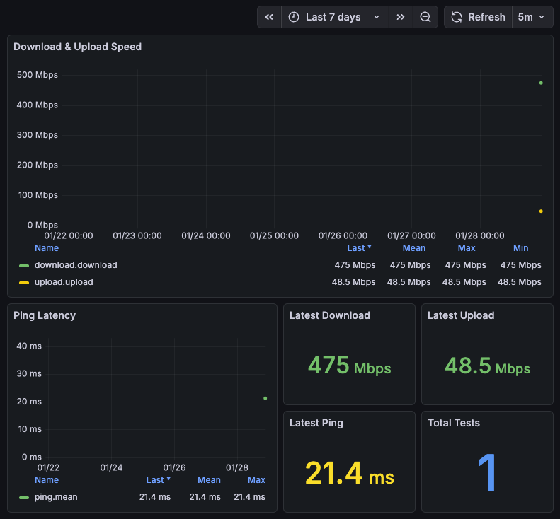

# Docker Grafana Speedtest

Track internet speed with InfluxDB and Grafana.  Speedtests 
by [Speedtest CLI](https://github.com/robinmanuelthiel/speedtest).

## Quick Start

```bash
# Install dependencies
curl -sSL https://get.docker.com | sh

# Download this repository
git clone https://github.com/mgaffigan/docker-grafana-speedtest.git
cd docker-grafana-speedtest

# Start the application
docker-compose up -d
```

**Grafana**: http://localhost:3000 (admin/admin)

## Configuration

Adjust test interval via `LOOP_DELAY` in `docker-compose.yml` (default: 3600 seconds).

See other options in https://github.com/robinmanuelthiel/speedtest

## Stopping

```bash
docker-compose down      # Stop containers
docker-compose down -v   # Stop and remove data
```

## Screenshots

http://localhost:3000/d/speedtest-dashboard/internet-speed-test?orgId=1&from=now-7d&to=now&timezone=browser&refresh=5m&kiosk=true



## License

This project is licensed under the MIT License - see the [LICENSE](LICENSE) file for details.